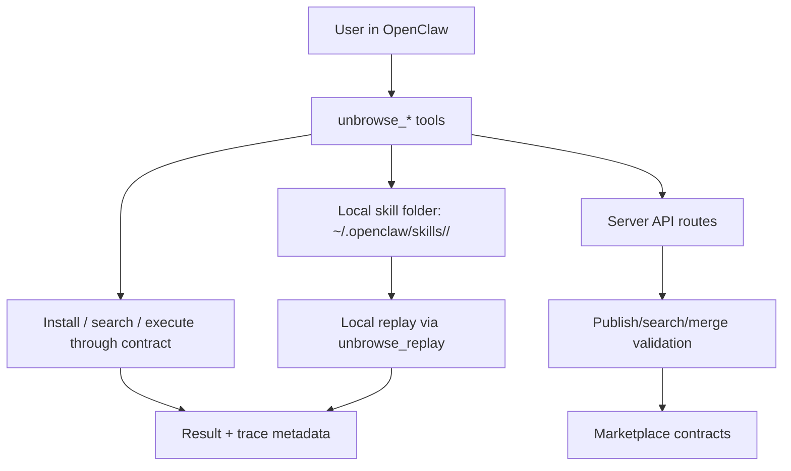

# Unbrowse (OpenClaw Plugin & Skill Ecosystem)

Unbrowse is the practical layer that turns real browser usage into reusable agent capabilities.

It is not a UI bot.

It observes how a site already behaves over the network, infers how to call it, and writes reusable artifacts that can be run by an LLM tool or shared with others.

## What problem Unbrowse solves

Most websites are built for humans, not agents.

- Agents that automate browsers through UI steps are slow and brittle.
- Existing integrations are often one-off and not shared.
- Network behavior changes silently, and agents break without visibility.

Unbrowse solves this by turning observed network calls into versioned skill artifacts.
The result is:

- deterministic local execution for private use
- optional shared execution through publish/search/execution contracts
- repeatable behavior across teams and agents

## Big picture: local first, then shared

Unbrowse has two main components:

- Extension: `packages/plugin` (local capture + local replay)
- Marketplace: `server` + `packages/web` (publish/search/install contracts + shared execution bridge)

Unbrowse runs in two clear modes.

1) Local mode (default)
- User captures traffic in OpenClaw.
- Skill artifacts are written to local disk.
- Replay happens locally by default.
- No marketplace publish required.

2) Shared mode (optional)
- User publishes a validated skill.
- Backend merge and contribution logic canonicalizes the public version.
- Other users can discover and install the skill.
- Execution can run through backend contracts when using published endpoint mappings.

Important behavior rule:

- Indexing/capture is local.
- Publishing is the explicit action that opens shared/backend paths.

## What actually runs where

Think of this as two components:

- Extension (`packages/plugin`): capture, local merge, local replay.
- Marketplace (`server` + `packages/web`): publish/search/install contracts, merge validation, and shared discovery/execution visibility.

There is also a marketplace boundary. This repo treats marketplace internals as a contract boundary:
- it documents route-level inputs/outputs and observable outcomes
- it does not document internal ranking/execution settlement internals



## Repository purpose by folder

### `packages/plugin/`
Contains OpenClaw plugin implementation and all user-facing tool behavior:

- capture from browser/CDP and HAR input
- parse and infer endpoint candidates
- generate skill package files
- local execution (`unbrowse_replay`)
- merge updates from repeated captures

### `server/`
Contains API routes and execution contracts used by plugin/web:

- publish/search/install endpoints
- route validation and auth checks
- ability and endpoint repositories
- server-side merge logic (`skill-merge`)
- execution policy, endpoint health updates, and trace metadata
- credentials and verification helpers

### `packages/web/`
Provides human workflows:

- search/discovery pages
- install and contributor views
- analytics/traces UI tied to server contracts

### `docs/`
Design docs, architecture docs, contributor process, onboarding docs.

## End-to-end user journey

### 1. Learn (local) from your browser

Use one of:

- `unbrowse_browse`
- `unbrowse_capture`
- `unbrowse_learn` (HAR file)
- `unbrowse_login` for auth-gated sessions

Outcomes:

- local skill directory created/updated in `~/.openclaw/skills/<service>/`
- local `SKILL.md`
- helper `scripts/`
- optional `references/`
- local `auth.json` when auth context is captured

### 2. Re-run locally

Use `unbrowse_replay` and `unbrowse_skills` for local-first execution.

If local files exist and endpoint context is available, local replay runs from local data and scripts.

### 3. Publish (optional)

Run `unbrowse_publish`.

- Plugin sends a publish payload to server routes.
- Backend validates and runs merge compatibility.
- Public version is updated by merge and contribution policy.
- Skill can be discovered by query and install flows.

### 4. Execute in shared mode (optional)

If installed from shared catalog, replay can hit server execution contracts, typically via:

`POST /marketplace/endpoints/:endpointId/execute`

Results include execution output and trace metadata where available.

## Why publish is a distinct action

Publishing is not just "copy local files."
It is an indexing action with validation and merge impact:

- canonical skill identity checks
- endpoint deduplication
- schema compatibility filtering
- contribution scoring updates

That is why you can learn privately without publishing.
That is also why contributors must treat parser/inference changes as merge-sensitive behavior changes.

## Artifacts and data model (important for contributors)

### Local artifacts

Inside `~/.openclaw/skills/<service>/`:

- `SKILL.md`: human + machine contract
- `scripts/`: execution helpers
- `references/*`: optional trace references
- `auth.json`: local auth/session state
- `ENDPOINTS.json` and mapping metadata for install/backend mode

### Public/shared artifacts

Publicly stored data is normalized and validated by server merge.
Only publish-safe shape is expected to be shared; raw session credentials are not the intent of published payloads.

## Security and trust model

This project keeps execution control local by default:

- local session auth material is local-first
- published payloads are filtered for sensitive values
- execution in shared mode is contract-driven and scoped

This is intentionally conservative: local privacy-first behavior does not depend on remote services.

## Payments status (explicit)

Payments are not enabled in this repository.

- Payment routes and wallet utilities may exist.
- Paid settlement/payout flows are not active in current behavior.
- Do not treat the repository as a paid-activation-first system.

## Skill merge and contribution behavior

Merging is central, not optional.

When captures repeat:
- plugin merges local changes into existing local service files
- server merge handles public version conflicts during publish

Expected merge signals:
- endpoint normalization/deduplication
- compatibility checks on request/response contracts
- merge output changes when parser behavior changes

If you change parser/merge/sanitizer behavior:
- update docs and expected merge outcomes
- add regression coverage for merge edge cases

## Tool reference

Core tools:

- `unbrowse_browse` – guided capture from browser context
- `unbrowse_capture` – capture network traffic and infer endpoints
- `unbrowse_learn` – ingest HAR files
- `unbrowse_login` – capture auth context for private/protected flows
- `unbrowse_replay` – run local execution and optional backend path
- `unbrowse_search` – search and install published skills
- `unbrowse_publish` – publish local skill
- `unbrowse_skills` – list local skills
- `unbrowse_wallet` – wallet setup/placeholder (inactive)
- `unbrowse_auth`, `unbrowse_do`, workflow helpers – advanced execution and orchestration

## Quick start

```bash
openclaw plugins install @getfoundry/unbrowse-openclaw
openclaw gateway restart
```

```bash
unbrowse_capture { "urls": ["https://example.com"] }
unbrowse_skills
unbrowse_replay { "service": "example" }
```

```bash
unbrowse_publish { "service": "example", "price": "0" }  # optional
unbrowse_search { "query": "analytics", "install": "<skill-id>" }  # optional
```

## Development map

- Typecheck: `npm run typecheck`
- Plugin tests: `bun test`, `bun test:e2e`, `bun test:oct`
- Server tests/dev/build: `pnpm test`, `pnpm dev`, `pnpm build`
- Web tests/dev/build: `pnpm dev`, `pnpm build`, `pnpm preview`

## Where to read next

- `docs/ARCHITECTURE.md`
- `docs/INTEGRATION_BOUNDARIES.md`
- `docs/CONTRIBUTOR_PLAYBOOK.md`
- `docs/QUICKSTART.md`
- `server/src/server/routes/README.md`
